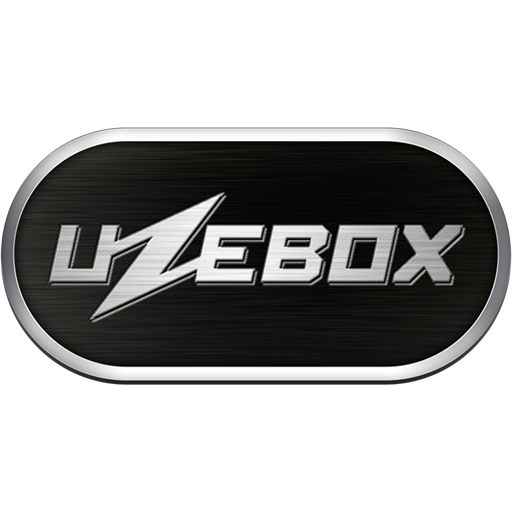

# Uzebox (Uzem)

### Description

Uzem is the official emulator for the Uzebox (a retro-minimalist 8-bit open source game console).

### License

MIT

### Icon

### Fanart

Help make me fanart!

### Screenshots

Help make me screenshots!
